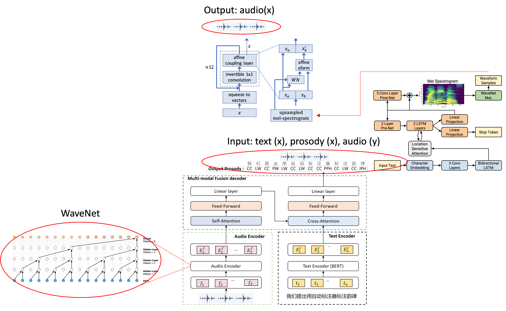
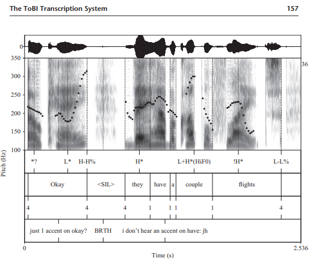

# ProSS
ProSS - Prosodic Speech Synthesis 

## Technologies
- WaveNet: https://arxiv.org/pdf/1609.03499v2.pdf
- BERT
- Automatic Prosody Annotation: https://arxiv.org/abs/2206.07956
- Tacotron2: https://arxiv.org/pdf/1712.05884.pdf | https://github.com/NVIDIA/tacotron2
- Waveglow: https://arxiv.org/pdf/1811.00002.pdf | https://github.com/NVIDIA/waveglow

## Datasets
Dataset: https://keithito.com/LJ-Speech-Dataset/
- Extract the dataset into 'src/ProSS/datasets/LJSpeech-1.1'

Other Dataset: http://www.festvox.org/cmu_arctic/
- Extract the dataset into 'src/ProSS/datasets/cmu_arctic/
    - This can be done with !wget -e robots=off -r -np http://www.festvox.org/cmu_arctic/cmu_arctic/cmu_us_bdl_arctic/
    - Currently only using 'cmu_us_bdl_arctic'

## Automatic Prosody Annotation
Method based upon this paper: https://arxiv.org/abs/2206.07956
- Audio Encoder: "PPG extractor: Phonetic posteriorgram (PPG)"
    - wav -> spectrogram -> mfccs -> phoneme dist.
        - alternatively I am developing a model capable of wav -> PPG conversion.
    - incredibly helpful read: https://medium.com/prathena/the-dummys-guide-to-mfcc-aceab2450fd
    - Wavenet code: https://github.com/vincentherrmann/pytorch-wavenet
- Text Encoder: Pre-Trained English BERT: https://huggingface.co/bert-base-uncased?text=The+goal+of+life+is+%5BMASK%5D.
    ## Annotations
    - based upon ToBI annotations: https://linguistics.ucla.edu/people/jun/papers%20in%20pdf/J54-ToBI%20Ch04%20ToBI%20and%20commentary-MIT%20Press2022.pdf

        
        
        ### Dataset Annotation
        - #### PyTobi: https://github.com/monikaUPF/PyToBI
            - Domínguez, M., Rohrer, P. and Soler-Company, J. 2019. PyToBI: A Toolkit for ToBI Labeling with Python Data Structures. In Proceedings of Interspeech, Graz, Austria, pp: 3675-3676.
            - Praat *[download required]: https://www.fon.hum.uva.nl/praat/
                -  place within the "PraatScripts" folder
            - Montreal Force Aligner (MFA) required to produce word alignment with wav file *[conda required]: https://montreal-forced-aligner.readthedocs.io/en/latest/
                - can be pip installed
                - great tutorial: http://eleanorchodroff.com/mfa_tutorial.html
                - colab notebook for LJSpeech dataset: https://colab.research.google.com/gist/NTT123/12264d15afad861cb897f7a20a01762e/mfa-ljspeech.ipynb#scrollTo=HcZE4uxyMhXg

# <b>Installation</b>
## Conda installation
    # {PLATFORM} = Windows, MacOSX, or Linux
    $ wget -q --show-progress https://repo.anaconda.com/miniconda/Miniconda3-latest-{PLATFORM}-x86_64.sh
    $ bash Miniconda3-latest-{PLATFORM}-x86_64.sh
## Montreal Forced Aligner (MFA) installation
    $ conda create -n aligner -c conda-forge montreal-forced-aligner -y
    
    # ACTIVATE ALIGNER
    $ source activate aligner

    # DEACTIVATE ALIGNER
    $ conda deactivate
## PyToBI
    # clone the pytobi repo in any location
    $ git clone https://github.com/monikaUPF/PyToBI.git

    # Follow Pytobi readme to install Praat and for complete installation
# <b>How to use</b>
## Alignment
    # should be able to run this and get output
    $ mfa align --help 

    # follow align_wav_text.ipynb to copy and prepare files for alignment

    # run below within /src/ProSS/alignment 
    $ mfa align -t ./temp -j 4 ./aligned_pre ./modified_librispeech-lexicon.txt ./english.zip ./aligned_post
## PyToBI
    # the /path/to/your/files should be the TextGrid files located in /src/ProSS/alignment/aligned_post with the associated .wav files.
    $ ./runpytobi.sh /path/to/your/files

